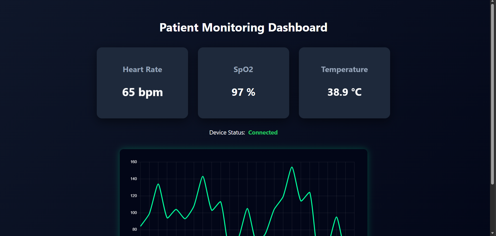
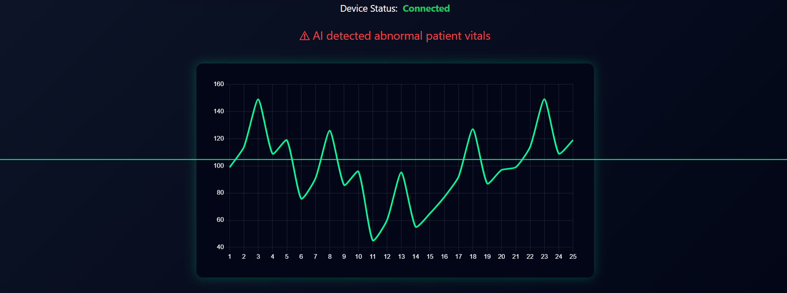

## Medical Device Monitoring and Simulation Platform

A full-stack system that simulates medical device vitals and displays them on a real-time monitoring dashboard.  
The platform mimics how hospital monitoring systems track patient vitals and trigger alerts when abnormal conditions are detected.

---

## Overview

This project simulates patient vital data such as heart rate, oxygen saturation (SpO₂), and body temperature using a Python service.  
The data is processed through a Node.js API and visualized on a React dashboard with real-time updates and alert detection.

The system demonstrates a simple architecture used in monitoring platforms for medical devices.

---

## Architecture

Python Simulator → Node.js API → React Dashboard

---

## Features

- Real-time patient vital monitoring
- Simulated medical device data
- Heartbeat waveform visualization
- AI-based anomaly detection
- Alert system for abnormal vitals
- Device connection status indicator
- Responsive monitoring dashboard UI

---

## Tech Stack

Frontend
- React
- Chart.js
- CSS

Backend
- Node.js
- Express.js

Data Simulation & AI
- Python
- FastAPI
- Scikit-learn

---

## Installation

### 1. Clone the repository
```git clone https://github.com/your-username/medical-device-simulator-system.git```

---

### 2. Start Python Simulator

Navigate to the python folder.
```
cd python
pip install fastapi uvicorn scikit-learn numpy
uvicorn simulator:app --reload --port 8001 
```
---

### 3. Start Node.js Backend
```
cd backend
npm install
npm start
```
---

### 4. Start React Frontend
```
cd frontend
npm install
npm start
```
## Future Improvements

- Store patient vitals in a database
- Support multiple patients
- Add authentication and role-based access
- Deploy the system using Docker and cloud infrastructure

---

## Screenshots



